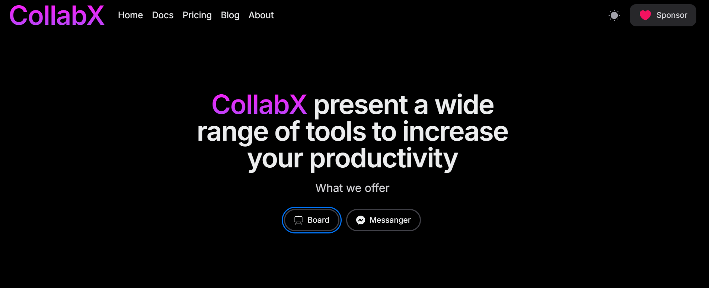
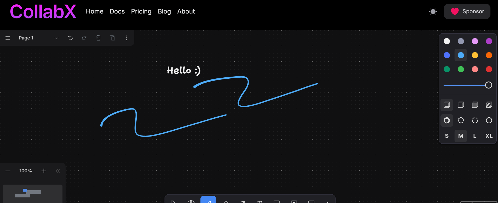

# React + Tldraw + Websocket + Tailwind + NextUI

# CollabX

## The goal of this project is to provide various collaborating tools

## Currently we have a collaborative whiteboard, but soon enough we will have all the features shown in image

## Whiteboard detail

## Key Features of whiteboard

- **Real-time Collaboration**: Users can draw on a shared whiteboard in real-time.
- **Undo/Redo Actions**: Supports undoing and redoing of drawing actions.
- **Room Creation**: Users can create rooms where collaboration takes place.
- **Join Rooms**: Users can join existing rooms via room IDs and access the current state of the whiteboard

## How to use it:

- Vist and click whitboard.
- It will create a room form you with a unique id. Which can seen in page url
- Share this URL with your friend. Enjoy 🎉
